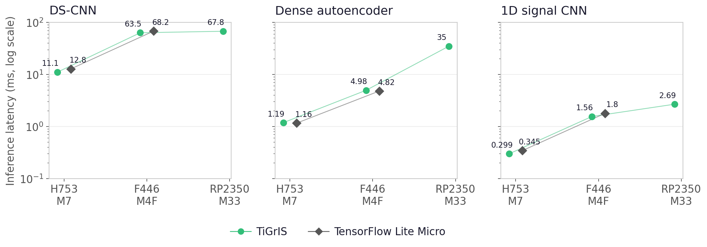

Compile once, run anywhere. Embedded ML gestures at that promise constantly and rarely proves it. Your model does not get to pick its chip, the product does, and it may have to run on several: the connected variant on an M33, the cost-down on an M4, the flagship on an M7, each chosen for radio, BOM cost, or the platform already in place, not for your model. Normally every target means putting the model back through the whole pipeline: re-quantize, re-analyze, re-solve the memory plan, re-validate against a fresh golden set, once per chip. We measured a shorter path. The compiled plan is the portable artifact: carry the same `.tgrs` to three different Cortex-M chips, regenerate only the target glue, and every one produces byte-for-byte identical output. Nothing before the plan re-runs.

It is not obvious this should hold. A cross-build proves your firmware compiles for a target. It does not prove the runtime computes the same numbers there, that its working set fits beside the rest of your firmware, or that a second chip family behaves the same way. We checked all three directly, on hardware.

The short version: in TiGrIS, portability is a property of the compiled plan, not a promise in a README. The compiler freezes the computation into a target-agnostic plan, code generation wires that plan to each target's kernel backend and flash layout, and the backend you choose is a performance decision rather than a correctness one.

We ran three INT8 models on three boards: a depthwise-separable DS-CNN, a dense anomaly-detection autoencoder, and a small 1D-signal CNN. Throughout, TiGrIS runs against TensorFlow Lite Micro with the kernel held constant, the same pinned CMSIS-NN build and the same weights, so the only thing that varies is the runtime. The exact boards, controls, and metric definitions are at the end.

## The plan is the invariant

When `tigris compile` finishes, the `.tgrs` plan already contains everything that decides the output: the operator sequence, the NHWC tensor layout, the quantization parameters, the fixed-point multipliers and shifts each requantization uses, and the static memory layout. None of that is recomputed on the device. The runtime walks the plan and executes it.

This is why the output is reproducible to the bit. Two boards running the same plan perform the same integer operations in the same order with the same rounding. There is no per-target recompilation of the model graph, and so no opening for a target's compiler, math library, or floating-point behavior to move a result. The common embedded workflow is the opposite: recompile the model for each target and hope the numbers line up. Here they line up because they are the same numbers.

A plan still has to reach the device and pick a kernel backend. That is what code generation does:

```bash
tigris codegen model.tgrs --backend cmsis-nn -o model.c
```

The generated C sets up the runtime memory, selects the kernel dispatch you asked for (`reference`, `cmsis-nn`, or `esp-nn`), and loads the plan from wherever that target keeps it: a file on a POSIX host, a flash partition on ESP-IDF, or linker-provided symbols on a bare-metal Cortex-M. You add the generated file to your firmware build and deploy the `.tgrs` next to it.

The important part is what codegen does not do. It does not touch the computation. The same plan produces the same result no matter which backend the generated harness dispatches to. Backends differ only in how fast they run. That claim is testable, so we tested it.

## Identical output, across cores and backends

For the tracked input, the TiGrIS output vector is byte-identical on the H753, the F446, and the RP2350. The maximum absolute difference between any two boards is zero. On the two STM32 boards, TiGrIS and TensorFlow Lite Micro also match bit-for-bit. This is a device-to-device result. The x86 TFLite interpreter rounds some gemmlowp ties differently from on-device CMSIS-NN, so it is not the reference here. The hardware is.

Switching the kernel backend does not change the output either. TiGrIS with its portable reference kernels and TiGrIS with CMSIS-NN produce the same int8 vector, again at zero difference. The backend is a dial for speed. Choosing CMSIS-NN over the reference path is a decision you can make per target without revalidating the model's numerics, which is what the `--backend` flag is for.

## Working set and latency

Same plan, same output, but the runtime around the kernels still decides how much memory the inference path needs and how fast it runs. The working-set figures are identical on all three boards, because the plan is the same. These are all-in figures: TiGrIS counts its arena, scratch, and runtime metadata, and TFLM's `arena_used` counts its equivalent.

| Model | TiGrIS | TensorFlow Lite Micro |
|---|---|---|
| DS-CNN | 16.9 KiB (17,287 B) | 22.2 KiB (22,692 B) |
| Dense autoencoder | 3.0 KiB (3,063 B) | 15.5 KiB (15,828 B) |
| 1D signal CNN | 2.8 KiB (2,855 B) | 2.9 KiB (2,980 B) |

The dense autoencoder is the clearest case. TiGrIS and TensorFlow Lite Micro run the same CMSIS-NN kernel on the same weights and return the same bytes, yet TiGrIS needs 3,063 bytes of working set against 15,828, a factor of 5.17. Both fit on these boards. But only the memory you do not spend on inference is left for the application, the protocol stack, buffers, and RTOS tasks. Ahead-of-time planning with fixed tensor offsets is where that difference comes from. On the M7 the TiGrIS benchmark firmware is also smaller in flash: 118 against 176 KiB for DS-CNN, 371 against 417 for the autoencoder, and 87 against 145 for the 1D CNN.

Latency is a more mixed picture, and worth reporting plainly.

| Model | Board | TiGrIS | TensorFlow Lite Micro |
|---|---|---|---|
| DS-CNN | H753 (M7, 480 MHz) | 11.14 ms | 12.80 ms |
| DS-CNN | F446 (M4F, 180 MHz) | 63.5 ms | 68.2 ms |
| DS-CNN | RP2350 (M33, 150 MHz) | 67.8 ms | n/a |
| Dense autoencoder | H753 | 1.19 ms | 1.16 ms |
| Dense autoencoder | F446 | 4.98 ms | 4.82 ms |
| Dense autoencoder | RP2350 | 35.0 ms | n/a |
| 1D signal CNN | H753 | 0.299 ms | 0.345 ms |
| 1D signal CNN | F446 | 1.56 ms | 1.80 ms |
| 1D signal CNN | RP2350 | 2.69 ms | n/a |

On the convolutional models TiGrIS is faster on both STM32 targets. On the dense autoencoder TensorFlow Lite Micro is fractionally ahead on the M7 (1.16 against 1.19 ms) and about 3.3% ahead on the M4F. The working-set result is the durable one precisely because it holds even where the latency does not.

The vendor kernels matter regardless. On the M7, CMSIS-NN is 7.4x faster than the portable reference path on DS-CNN, 2.6x on the autoencoder, and 5.4x on the 1D CNN. Kernel optimization and runtime integration solve different problems, and TiGrIS keeps the vendor kernel while owning the memory plan.



## When the board becomes the bottleneck

The same plan produces the same bytes on every board, but the boards do not have the same path to their own weights. On the RP2350 the dense autoencoder takes 35.0 ms, against 1.19 ms on the H753 and 4.98 ms on the F446. Its roughly 265 KB of weights are read once per inference with almost no reuse, and on the Pico 2 W those reads come through external QSPI flash over execute-in-place, so the workload is bandwidth-bound rather than compute-bound. The convolutional models reuse weights across spatial positions and are affected far less.

This is the honest boundary of a portability claim. One plan, one set of outputs, and the memory hierarchy of the board underneath is still visible in the latency. It is why a portability result has to be measured on the hardware in question rather than argued from the source. The compile-time `--xip` flag exists for exactly this trade: weights stay in flash and are read in place, at the cost of that flash bandwidth.

## How the comparison was controlled

Every number here comes from one pinned benchmark run, [`tigris-bench` at commit `9e2a42e`](https://github.com/raws-labs/tigris-bench/tree/9e2a42e5e1d9bc12227807395ca302e963db7a26/cortex-m-deployability), which records all 27 device results and their output vectors.

The three boards:

| Board | MCU | Core | Clock |
|---|---|---|---|
| NUCLEO-H753ZI | STM32H753ZI | Cortex-M7 | 480 MHz |
| NUCLEO-F446RE | STM32F446RE | Cortex-M4F | 180 MHz |
| Raspberry Pi Pico 2 W | RP2350 | Cortex-M33 | 150 MHz |

The models are a depthwise-separable DS-CNN (about 23K parameters), a dense anomaly-detection autoencoder (about 266K parameters, ten fully connected layers), and a small 1D-signal CNN (about 5.4K parameters). They are deterministic benchmark graphs with seeded weights. This measures deployment cost and numerical parity, not keyword-spotting, anomaly-detection, or forecasting accuracy.

The comparison is set up so that only the runtime differs. TiGrIS and TensorFlow Lite Micro use identical weights: the TiGrIS plan is reconstructed from the same TFLite INT8 artifact. Both link the same pinned CMSIS-NN revision, `6d9d61d8`. All firmware is built at `-O2`. Latency is the median of 30 timed inferences, and every run checks that the board is at its rated clock. The per-target TiGrIS firmware is generated from the plan with `tigris codegen`, so the runtime setup, kernel dispatch, and plan loading on each board come out of the same `.tgrs`. The boards were flashed and captured remotely on the [SiliconRig](https://siliconrig.dev) hardware-in-the-loop lab. TensorFlow Lite Micro runs on the two STM32 boards only, because there is no prebuilt CMSIS-NN library for Cortex-M33 in this harness.

One metric needs a precise definition. The working set is the memory the inference path needs while it runs: activations, kernel scratch, and runtime metadata. Weights stay in flash and are excluded, and stack is excluded. For TiGrIS it is the arena high-water mark plus spill, scratch, the tensor table, and the plan-sized executor workspace. For TensorFlow Lite Micro it is `arena_used`. Both count their runtime metadata, so the comparison is all-in on each side.

## Why this matters

The Cortex-M market is spread across many vendors and cores, and the usual answer is to port and revalidate a model per target. A plan that is bit-identical across an M7, an M4F, and an M33 removes that step. You compile once, generate a harness per target, pick the backend that is fastest on each, and get the same output everywhere. For anyone who has to trust or sign off on a number, output that is reproducible to the bit across silicon is worth more than a few percent of latency.

The same property that makes the plan portable, that it is driven by a memory budget, also runs models that do not fit at all. When a model's activations exceed the SRAM on the part, a non-tiling runtime fails at allocation. The compiler tiles the plan to the budget instead. MobileNetV2 needs 735 KB of activations and still runs, tiled to a 300 KB working set, on parts where its full footprint never could. That is its own result ([the tiling numbers in tigris-bench](https://github.com/raws-labs/tigris-bench)), but it is the same plan doing the work.

## Try it

The full benchmark, the build controls, the raw capture procedure, and the parity gate are in [tigris-bench](https://github.com/raws-labs/tigris-bench). The tracked summary carries every cell's numbers and its output vector, so the results here can be reproduced and checked.

---

*TiGrIS is developed at [RAWS Labs](https://www.raws.at), an applied research and engineering lab. If you are shipping one model across more than one chip, we are interested in hearing about it.*
