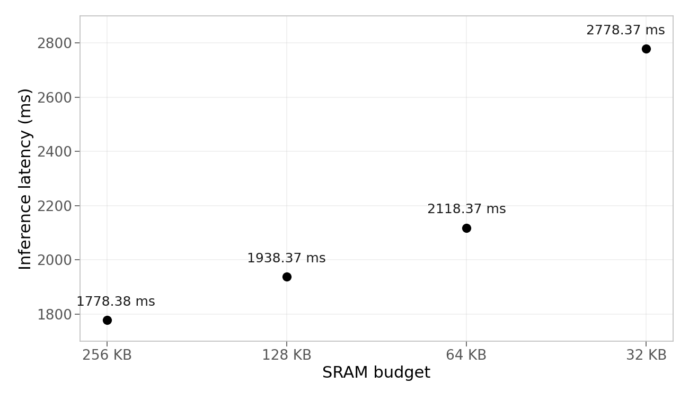

If you've deployed ML on an embedded device, you've probably faced this issue. But you need to get this to work, so you quantize to int8, you prune, you try a smaller architecture. Eventually TFLite Micro's `AllocateTensors()` returns `kTfLiteOk` and you move on... with a model that's worse than what you trained and intended to deploy.

TiGrIS takes a completely different approach: instead of shrinking or manipulating the model, it tiles the computation to fit the memory budget you actually have.

## What TiGrIS is

TiGrIS (**Ti**led **Gr**aph **I**nference **S**cheduler) is an ahead-of-time compiler and minimal C99 runtime for deploying ML models on resource-constrained embedded hardware. It is neither an interpreter, nor a framework. It's a combination of a compiler that emits a binary execution plan and a runtime that follows it. The runtime performs no internal heap allocation during inference: the application supplies the planned arenas and the small, plan-sized executor workspace.

The design separates concerns cleanly: the compiler runs on your workstation where compute and memory are cheap, the runtime runs on the embedded device where every byte matters. Graph optimization, memory planning, and tiling decisions all happen at compile time.

## Components

TiGrIS has three components that form a pipeline from trained model to inference:

### The toolchain (`tigris`)

A Python CLI that ingests a model, analyzes its memory profile, compiles it into an execution plan, and optionally generates backend-specific C source. Currently imports from ONNX, but the compiler operates on an internal graph intermediate representation (IR). The ingestion frontend is a thin layer, making it straightforward to add importers for other formats (TFLite, PyTorch ExportedProgram, etc.) as needed.

```bash
tigris analyze model.onnx -m 256K -f 4M
tigris compile model.onnx -m 128K -f 4M --xip -o model.tgrs
tigris codegen model.tgrs --backend esp-nn -o model.c
```

`-m` sets the SRAM budget the compiler must respect. `-f` sets the flash budget for validation. `--xip` (execute in place) tells the compiler that model weights will be read directly from flash at runtime via memory-mapped I/O instead of copying them into RAM. This is the normal mode for embedded deployment, where weights are too large for SRAM but sit comfortably in flash.

`codegen` takes a compiled `.tgrs` plan and emits a standalone C file that runs inference. `--backend` selects which kernel implementations to use: `reference` (portable C), `esp-nn` (Espressif's SIMD-optimized kernels for ESP32), or `cmsis-nn` (Arm's optimized kernels). The same plan for different kernels, so you can pick the backend that matches your target hardware.

### The execution plan (`.tgrs`)

The compiler's output is a binary artifact containing everything the runtime needs:

- Every operator call, in execution order
- Every tensor's size, shape, quantization parameters, and memory pool assignment (SRAM, PSRAM, or flash)
- Per-channel multipliers and shifts (no float math on device)
- LZ4-compressed weight blocks (decompressed on the fly from flash)

There's no flatbuffer parsing, no protobuf, no interpreter dispatch loop. Just a flat array of op structs the runtime walks sequentially.

### The runtime (`tigris-runtime`)

A C99 library (~8KB of code) that reads a `.tgrs` plan and executes it. It takes caller-owned memory buffers and a pointer to the plan in flash, then runs inference without allocating internally. The runtime itself is model-agnostic; all model-specific information lives in the plan.

## Pluggable kernel backends

The binary plan doesn't contain any executable code. It solely describes *what* to compute, not *how*. At build time, you pick a kernel backend that provides the actual operator implementations:

| Backend | Target | Notes |
|---------|--------|-------|
| `reference` | Any C99 | Portable scalar kernels |
| `esp-nn` | ESP32 family | Espressif's optimized kernels (SIMD on S3/P4) |
| `cmsis-nn` | Cortex-M family | Arm's optimized kernels (DSP on M4/M7, Helium on M55) |

The same plan can run with a backend selected for the target build. The backend interface is a single struct of function pointers, so adding a new backend means filling in that struct with your kernel implementations. Want to target a new chip with vendor-optimized kernels? Write a thin backend, plug it in, and you're ready to go.

## Memory hierarchy

Most embedded devices don't have just one kind of memory. They have a hierarchy with wildly different speeds and sizes. TiGrIS can be made aware of this hierarchy and therefore plan for it at compile time.

**SRAM** is the fast, scarce resource. On a typical Cortex-M or ESP32, you get 256–512KB. This is where activations and scratch buffers live during inference. The `-m` flag sets this budget, and the compiler guarantees it won't be exceeded.

**PSRAM** (or any slower external RAM) is required for multi-stage models, meaning any model whose activations exceed the SRAM budget. An ESP32-S3 ships with 2-16 MB depending on variant. It's 5-10x slower than SRAM, but much larger. Intermediate tensors spill from SRAM to PSRAM between stages, and the compiler schedules cold tensors there when they aren't on the hot path. You specify it as a second `-m` flag: `-m 256K -m 4M` means 256KB fast + 4MB slow. The compiler decides what goes where. Tensors accessed frequently or by SIMD kernels stay in SRAM, while larger tensors that can tolerate the latency get placed in PSRAM. Models that fit in a single stage can run without PSRAM.

**Flash** stores model weights. With `--xip` weights are read directly from flash via memory-mapped I/O at inference time and are never copied into RAM. This is critical because weights are often the largest part of the model. A DS-CNN's weights are ~80KB, but a MobileNetV2 has several megabytes. Without XIP, those weights would eat your entire SRAM budget before activations even enter the picture. The `-f` flag sets the flash budget so the compiler can validate that the model actually fits on your target's storage.

The compiler's memory planner sees all three tiers. When it runs USMP (Unified Static Memory Planning), it packs tensor lifetimes into the SRAM arena first, spills to PSRAM when necessary, and maps weights to flash. The resulting plan bakes in every address and every transfer. The runtime doesn't make placement decisions.

## How tiling works

TiGrIS uses three techniques, applied in order, to fit a model into a given SRAM budget.

**Temporal partitioning** is the first step. The compiler walks the operator graph and groups consecutive ops into stages such that each stage's live tensors fit in the budget. Between stages, intermediate tensors are spilled to slow memory (PSRAM) and reloaded when needed. This is analogous to register spilling in a traditional compiler, but for tensor memory. If the model already fits in a single stage, no partitioning is needed.

**Spatial tiling** handles stages where even a single operator's input and output tensors exceed the budget. A convolutional layer doesn't need the entire input tensor at once. It reads a small spatial window per output pixel. If you process output rows in strips, say 24 rows at a time instead of all 96, you only need to hold one strip of input and one strip of output in SRAM simultaneously. Peak memory drops proportionally. The compiler determines how many strips are needed, how many halo rows to overlap for convolution padding, and where to spill intermediates.

This is a well-known technique. [MCUNet](https://mcunet.mit.edu/) published the idea in 2021 and showed results on models found by neural architecture search. TiGrIS applies it to arbitrary models.

**Chain tiling** is an optimization on top of spatial tiling. When consecutive stages are all spatially tileable (e.g. Conv followed by DW Conv followed by PW Conv), the compiler can fuse them into a single streaming pass. The intermediate tensors between fused ops never fully materialize in the arena. This significantly reduces both memory and the number of PSRAM round-trips.

## Benchmarks

This introductory article stays with the ESP32-S3 experiment that motivated it. Every number here comes from one pinned benchmark run, [`tigris-bench` at commit `9e2a42e`](https://github.com/raws-labs/tigris-bench/tree/9e2a42e5e1d9bc12227807395ca302e963db7a26/tflm-esp32s3), which records all ten device results.

### Hardware and method

The board is an ESP32-S3-DevKitC-1 N16R8: dual Xtensa LX7 cores at 240 MHz,
512 KB on-chip SRAM, 8 MB octal PSRAM at 80 MHz, and 16 MB flash. The complete
matrix was captured through SiliconRig. The lockfiles pin ESP-IDF 5.4.0,
ESP-NN 1.1.2, and esp-tflite-micro 1.3.5.

Each measurement discards three warmup runs and reports the mean of ten timed
runs using `esp_timer_get_time()`. Inputs are deterministic. Watchdogs are
disabled to avoid timing interference. The INT8 TiGrIS models are reconstructed
from the exact TFLite models embedded in the TFLM firmware, so the comparison
uses the same weights, quantization, input, and ESP-NN kernels. The float cells
in the snapshot are independently initialized diagnostics and are not used for
cross-framework claims.

Every successful device result is checked against its model-specific host
reference. TiGrIS INT8 outputs may differ by at most one quantized unit; the
TFLM DS-CNN cell allows four because ESP-NN differs from the host TFLite
interpreter by four units at this quantization scale.

### When the model fits: DS-CNN

The matched INT8 DS-CNN is the no-tiling baseline:

| Runtime | Kernel | Mean latency | Plan/model artifact | Output |
|---|---|---:|---:|---|
| TiGrIS | ESP-NN | 29.39 ms | 39 KB plan | same winning class |
| TFLite Micro | ESP-NN | 30.43 ms | 41 KB model | same winning class |

TiGrIS has 3.4% lower mean latency in this capture and its plan artifact is
4.9% smaller. Those are small differences, which is the point: when the model
fits, the scheduling layer does not impose a meaningful latency penalty. The
two device outputs choose the same class; their largest per-logit difference is
4 INT8 units. This is not a byte-exact cross-runtime claim.

The table deliberately omits a RAM comparison. TiGrIS reports its planned fast
arena while TFLM reports a configured tensor arena; neither number is an
all-in, apples-to-apples working set in this ESP harness.

### When it does not: MobileNetV1

For the matched INT8 MobileNetV1 at 128x128, the harness can provision a 232 KB
fast arena under the 256 KB compiler budget after reserving device headroom. At
a 256 KB TFLM tensor arena, `AllocateTensors()` fails. TiGrIS runs the same
model by partitioning it and spilling intermediate tensors to PSRAM:

| TiGrIS budget | Actual fast arena | Executor workspace | Mean latency | Compiled stages |
|---:|---:|---:|---:|---|
| 256 KB | 232 KB | 599 B | 1778.38 ms | 4 (1 normal + 3 chain) |
| 128 KB | 128 KB | 143 B | 1938.37 ms | 9 (1 normal + 8 tiled) |
| 64 KB | 64 KB | 143 B | 2118.37 ms | 13 (1 normal + 12 tiled) |
| 32 KB | 32 KB | 143 B | 2778.37 ms | 25 (1 normal + 24 tiled) |
| TFLM: 256 KB arena | — | — | allocation failed | — |



The fast-arena column is TiGrIS's provisioned on-chip arena; it does not include
PSRAM spill storage. The executor workspace is shown separately, and is sized
from the plan rather than reserved at a fixed worst-case size. The compiled plan
is about 3.4 MB in flash.

Relative to the 256 KB-budget capture, the 128, 64, and 32 KB runs are **9.0%,
19.1%, and 56.2%** slower. This is the trade: progressively tighter on-chip
memory costs more PSRAM traffic and more tiled stages, but the same model still
runs. All four TiGrIS device outputs match the host TFLite reference exactly.

These benchmark models and deterministic inputs are synthetic; the MobileNet
output is therefore evidence of correct execution and deployability, not of
application accuracy. Likewise, the TFLM result establishes failure at the
tested 256 KB arena only. It does not claim that TFLM could never run with a
larger arena on different hardware.

## What's next

- Tiling support for more operator classes. Currently, ops that collapse or reshape spatial dimensions (Flatten, Reshape, Gemm, Softmax, ReduceMean) are untileable and force the compiler to keep their full tensors in SRAM. Extending tiling to cover these cases would allow tighter budgets on models with large fully-connected layers.
- PSRAM-aware spill scheduling. Currently all inter-stage spills go to PSRAM uniformly. Smarter placement based on tensor access patterns and reuse distance could reduce the number of slow-memory round-trips, especially at small budgets.
- Tiling along non-height axes. The current spatial tiling always splits along the height dimension. For operators with wide but shallow feature maps, width-axis or channel-axis tiling could be more effective.

## Try it

TiGrIS is open source under Apache 2.0.

```bash
$ pip install tigris-ml
$ tigris analyze mobilenetv2.onnx -m 256K -f 16M
╭──────────────────────── TiGrIS - mobilenetv2 ────────────────────────╮
│ Operators            65                                              │
│ Tensors              248 (66 activations)                            │
│ Peak memory (naive)  4.59 MiB                                        │
│ Largest tensor       1x96x112x112 (4.59 MiB)                         │
│ Dtype                float32                                         │
╰──────────────────────────────────────────────────────────────────────╯
╭──────────────────────────────── SRAM ────────────────────────────────╮
│ Budget              256.00 KiB                                       │
│ Scheduled peak      254.62 KiB (5.4% of naive peak)                  │
│ Stages              42                                               │
│ Spill / reload I/O  24.56 MiB / 25.59 MiB                            │
│                                                                      │
│ Need tiling         31 of 42 stages                                  │
│   tileable          6 (54 tiles, max halo 2)                         │
╰────────────────  PASS - tiling resolves all stages  ─────────────────╯
╭──────────────────────────────── Flash ───────────────────────────────╮
│ Budget            16.00 MiB                                          │
│ Weight data       13.31 MiB                                          │
│ Plan overhead      0.01 MiB                                          │
│ Plan (est.)       13.32 MiB                                          │
│ Plan INT8 (est.)   3.34 MiB                                          │
╰───────────────────────  PASS - plan fits  ───────────────────────────╯
```

The model's naive peak is 4.59 MiB, but TiGrIS schedules it into 256 KiB of SRAM through temporal partitioning and spatial tiling. No hardware required to run `analyze`.

GitHub: [github.com/raws-labs/tigris](https://github.com/raws-labs/tigris)

---

*TiGrIS is developed at [RAWS Labs](https://www.raws.at), an applied research and engineering lab. If you are working against a memory budget like the one above, we are interested in hearing about it.*
